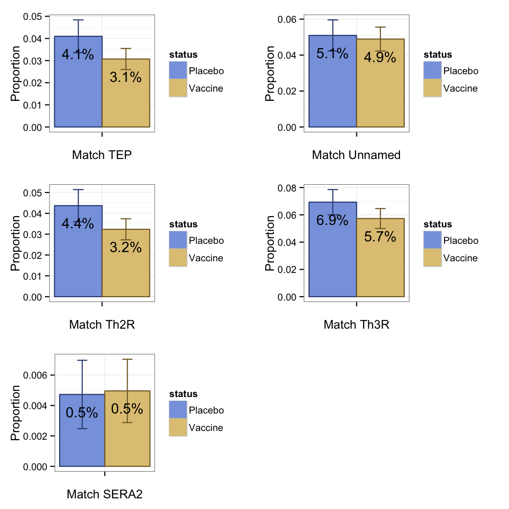

# Descriptive analysis of genotype data

## Setup

### Require `ggplot2` and `plyr`


```r
require(ggplot2)
require(plyr)
```

### Colors


```r
blue = rgb(0.330, 0.484, 0.828)
light_blue = rgb(0.531, 0.639, 0.880)
dark_blue = rgb(0.198, 0.290, 0.500)
yellow = rgb(0.829, 0.680, 0.306)
light_yellow = rgb(0.880, 0.776, 0.514)
dark_yellow = rgb(0.497, 0.408, 0.183)
```

### Multiplot

```r
# Multiple plot function
#
# ggplot objects can be passed in ..., or to plotlist (as a list of ggplot objects)
# - cols:   Number of columns in layout
# - layout: A matrix specifying the layout. If present, 'cols' is ignored.
#
# If the layout is something like matrix(c(1,2,3,3), nrow=2, byrow=TRUE),
# then plot 1 will go in the upper left, 2 will go in the upper right, and
# 3 will go all the way across the bottom.
#
multiplot <- function(..., plotlist=NULL, file, cols=1, layout=NULL) {
  require(grid)

  # Make a list from the ... arguments and plotlist
  plots <- c(list(...), plotlist)

  numPlots = length(plots)

  # If layout is NULL, then use 'cols' to determine layout
  if (is.null(layout)) {
    # Make the panel
    # ncol: Number of columns of plots
    # nrow: Number of rows needed, calculated from # of cols
    layout <- matrix(seq(1, cols * ceiling(numPlots/cols)),
                    ncol = cols, nrow = ceiling(numPlots/cols))
  }

 if (numPlots==1) {
    print(plots[[1]])

  } else {
    # Set up the page
    grid.newpage()
    pushViewport(viewport(layout = grid.layout(nrow(layout), ncol(layout))))

    # Make each plot, in the correct location
    for (i in 1:numPlots) {
      # Get the i,j matrix positions of the regions that contain this subplot
      matchidx <- as.data.frame(which(layout == i, arr.ind = TRUE))

      print(plots[[i]], vp = viewport(layout.pos.row = matchidx$row,
                                      layout.pos.col = matchidx$col))
    }
  }
}
```

### Load marks file


```r
marks_data = read.table("../adata/marks_data_c.tsv", header = TRUE)
```

### Randomly subsample to a single parasite per subject


```r
subsample <- function(marks_data) {
	shuffled = marks_data[sample(nrow(marks_data)),]
	from = which(duplicated(shuffled[c("subject","sample","locus","mark_name")]))
	to = which(duplicated(shuffled[c("subject","sample","locus","mark_name")], fromLast=TRUE))
	sampled = shuffled[cbind(from,to), ]	
	return(sampled)
}
```

### Subset to a specific locus / mark combination


```r
marked_subset <- function(marks_data, input_locus, input_mark) {
	sub = subset(marks_data, locus == input_locus & mark_name == input_mark)
	return(sub)
}
```

### New function curtesy of Michal

```r
getGtSample <- function(marks_data, input_locus, input_mark, seed=NULL) {
	marks_data <- subset(marks_data, locus == input_locus & mark_name == input_mark)
	if (!is.null(seed)){ set.seed(seed) }
	marks_data <- marks_data[sample(NROW(marks_data)),]
	idx <- which(!duplicated(marks_data$subject))
	return(marks_data[idx,])
}
```

### Summarize mean and standard deviation of histogram bins across subsamples


```r
average_counts <- function(marks_data, input_locus, input_mark) {
	tallies <- data.frame(mark_value= numeric(0), y= numeric(0), replicate = numeric(0))
	for (i in 1:100) {
		subsetted = getGtSample(marks_data, input_locus, input_mark)
		counts = ddply(subsetted, "mark_value", summarise, y = length(mark_value))
		counts$replicate <- i
		tallies <- rbind(tallies, counts)
	}
	summary = ddply(tallies,~mark_value,summarise,mean=mean(y),sd=sd(y))
	return(summary)
}
```

### Build histogram from summary


```r
mark_histogram <- function(summary, xlabel) {
	summary2 <- summary
	summary2$mark_value <- factor(summary2$mark_value)
	ggplot(summary2, aes(x=mark_value, y=mean)) +
     geom_bar(position=position_dodge(), stat="identity", colour = dark_blue, fill = light_blue) +
     geom_errorbar(aes(ymin=mean-sd, ymax=mean+sd), width=.2, position=position_dodge(.9)) +
     xlab(xlabel) +
     ylab("Count") +
     theme_bw()
}
```

## Analysis


```r
pTEP = mark_histogram(average_counts(marks_data, "TEP", "hamming_3D7"), "Hamming distance TEP")
pUnnamed = mark_histogram(average_counts(marks_data, "Unnamed", "hamming_3D7"), "Hamming distance Unnamed")
pTh2R = mark_histogram(average_counts(marks_data, "Th2R", "hamming_3D7"), "Hamming distance Th2R")
pTh3R = mark_histogram(average_counts(marks_data, "Th3R", "hamming_3D7"), "Hamming distance Th3R")
pSERA2 = mark_histogram(average_counts(marks_data, "SERA2", "hamming_3D7"), "Hamming distance SERA2")
pTRAP = mark_histogram(average_counts(marks_data, "TRAP", "hamming_3D7"), "Hamming distance TRAP")
multiplot(pTEP, pUnnamed, pTh2R, pTh3R, pSERA2, pTRAP, cols=2, layout=matrix(c(1,2,3,4,5,6), nrow=3, byrow=TRUE))
```

 


