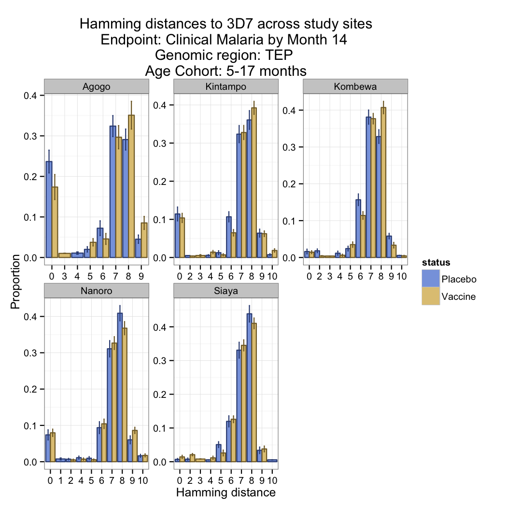
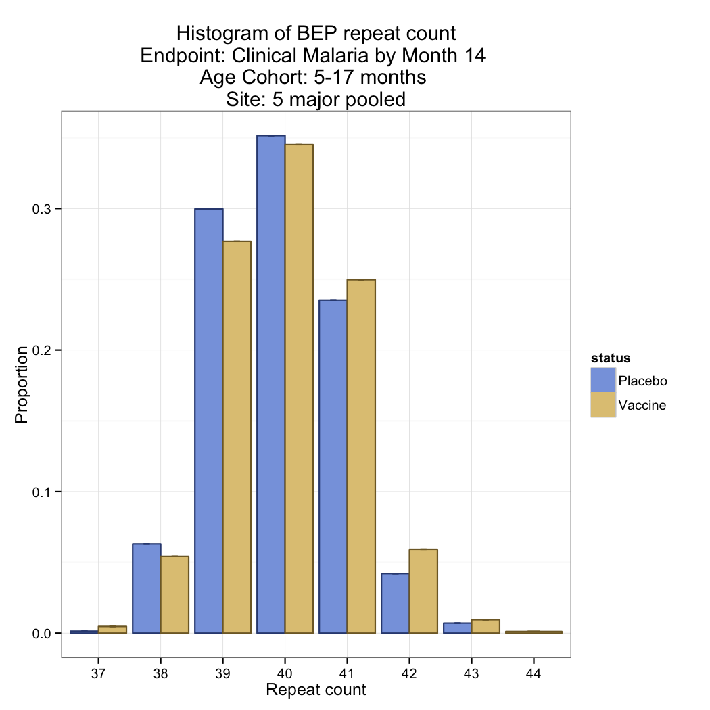
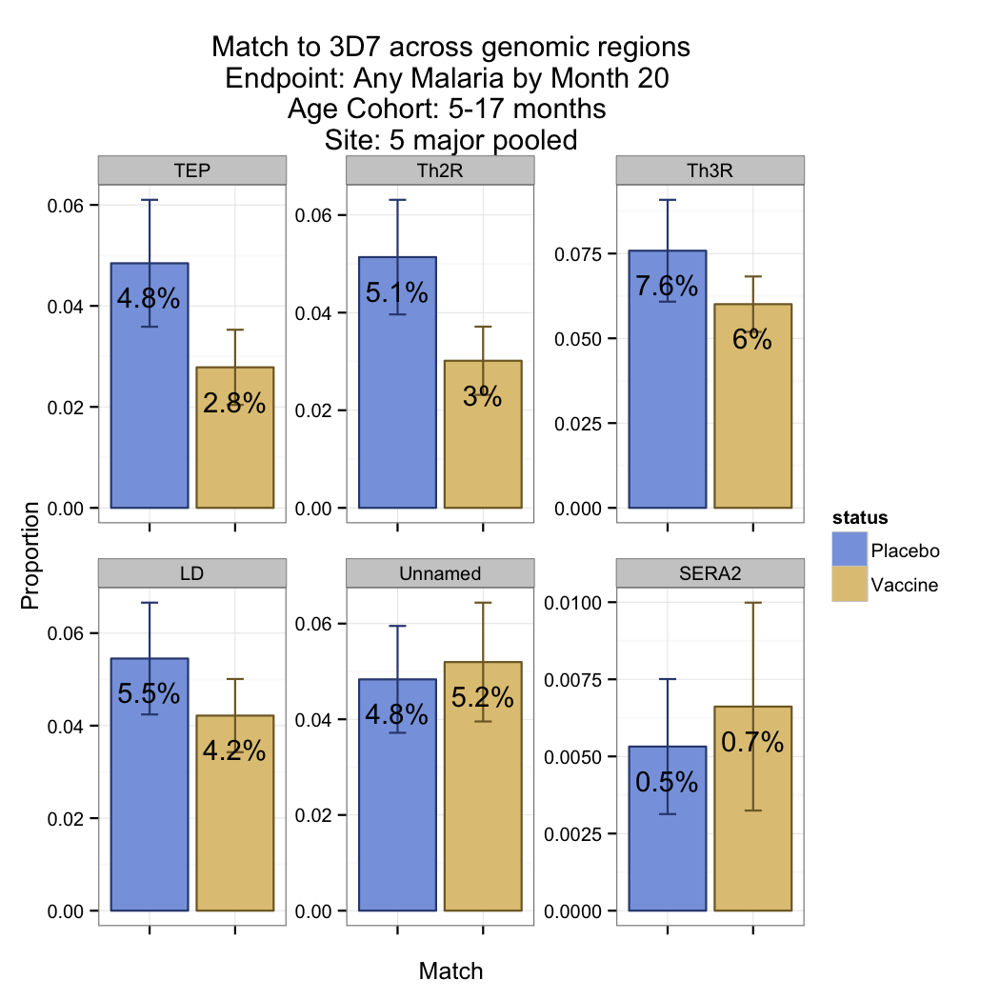
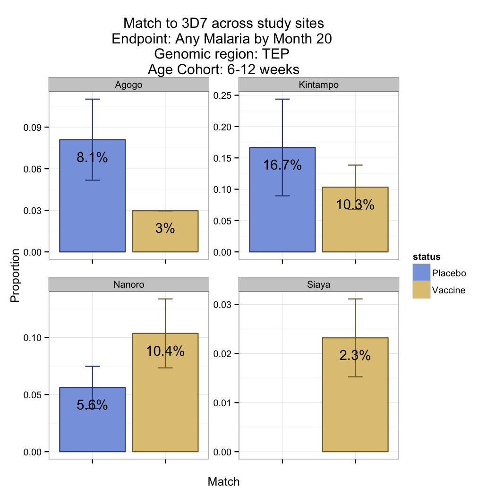

# Descriptive analysis of genotype data

## Setup

Set global variables and load packages and functions.

Load marks file.

Subset to just the 5 major sites.

Make function to randomly subsample to a single parasite per subject for a specific locus / mark / vaccine status combination.

Make function to summarize mean and standard deviation of histogram bins across subsamples.

Make plotting functions.

## Clinical

### Multiplicity, 6-12 weeks

 

### Multiplicity, 5-17 months

 

### Match, 6-12 weeks

 

### Hamming distance, 6-12 weeks

 

### Match, 5-17 months

 

### Hamming distance, 5-17 months

 

### TEP Match by site, 6-12 weeks

 

### TEP Hamming distance by site, 6-12 weeks

 

### TEP Match by site, 5-17 months

 

### TEP Hamming distance by site, 5-17 months

 

### BEP Match, 6-12 weeks

 

### BEP Match, 5-17 months

 

### BEP Distribution, 6-12 weeks

 

### BEP Distribution, 5-17 months

 

## Cross-sectional

### Multiplicity, 6-12 weeks

 

### Multiplicity, 5-17 months

 

### Match, 6-12 weeks

 

### Hamming distance, 6-12 weeks

 

### Match, 5-17 months

 

### Hamming distance, 5-17 months

 

### TEP Match by site, 6-12 weeks

 

### TEP Hamming distance by site, 6-12 weeks

 

### TEP Match by site, 5-17 months

 

### TEP Hamming distance by site, 5-17 months

 

### BEP Match, 6-12 weeks

 

### BEP Match, 5-17 months

 

### BEP Distribution, 6-12 weeks

 

### BEP Distribution, 5-17 months

 
