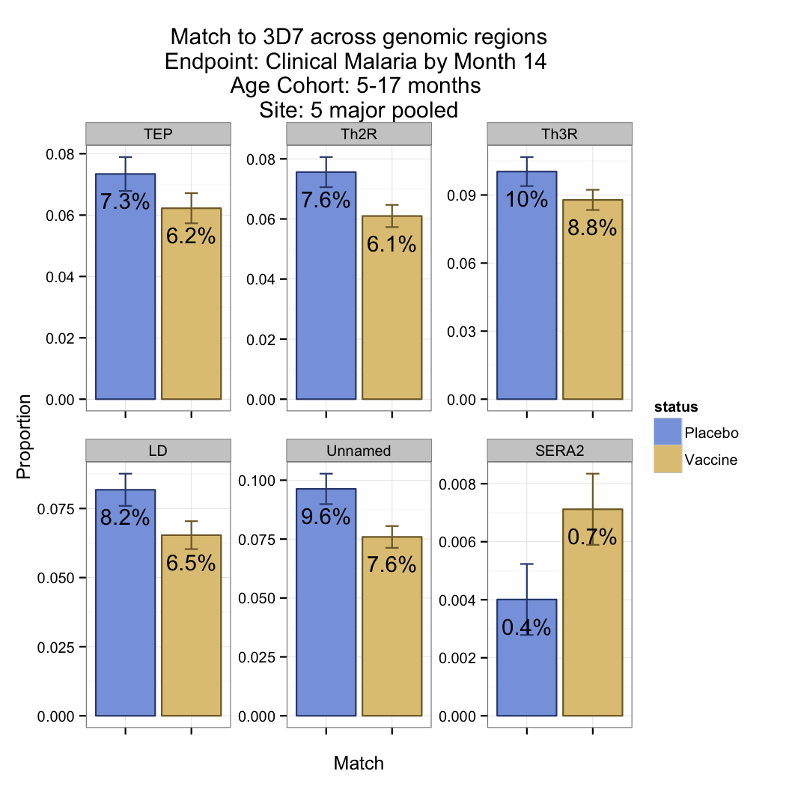
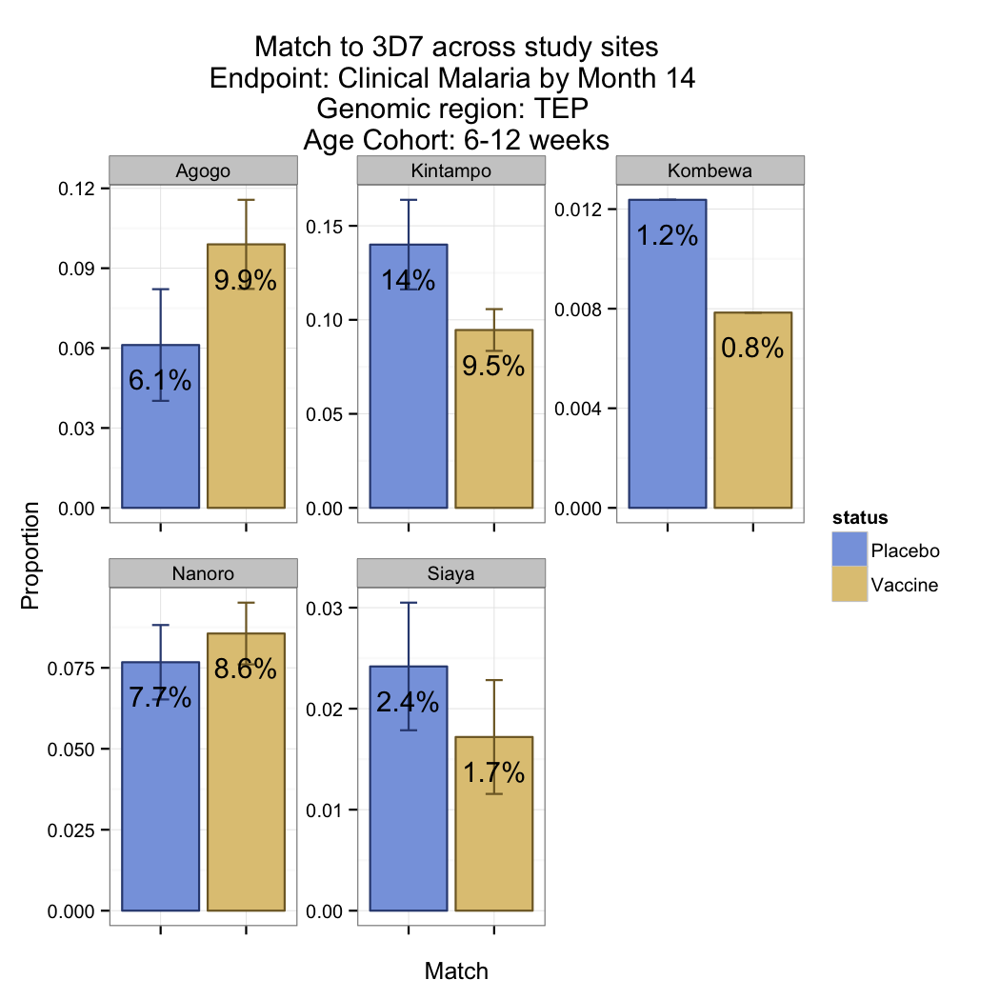
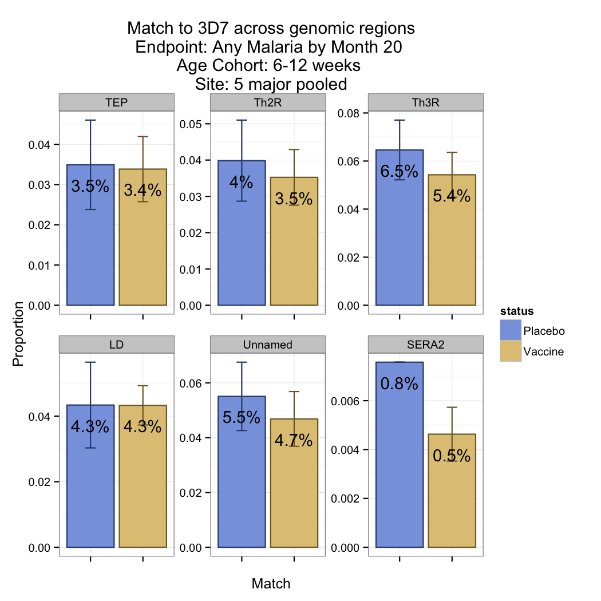
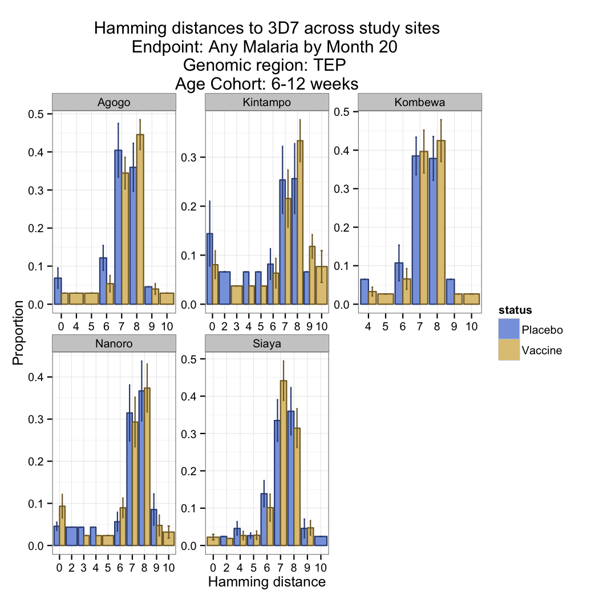
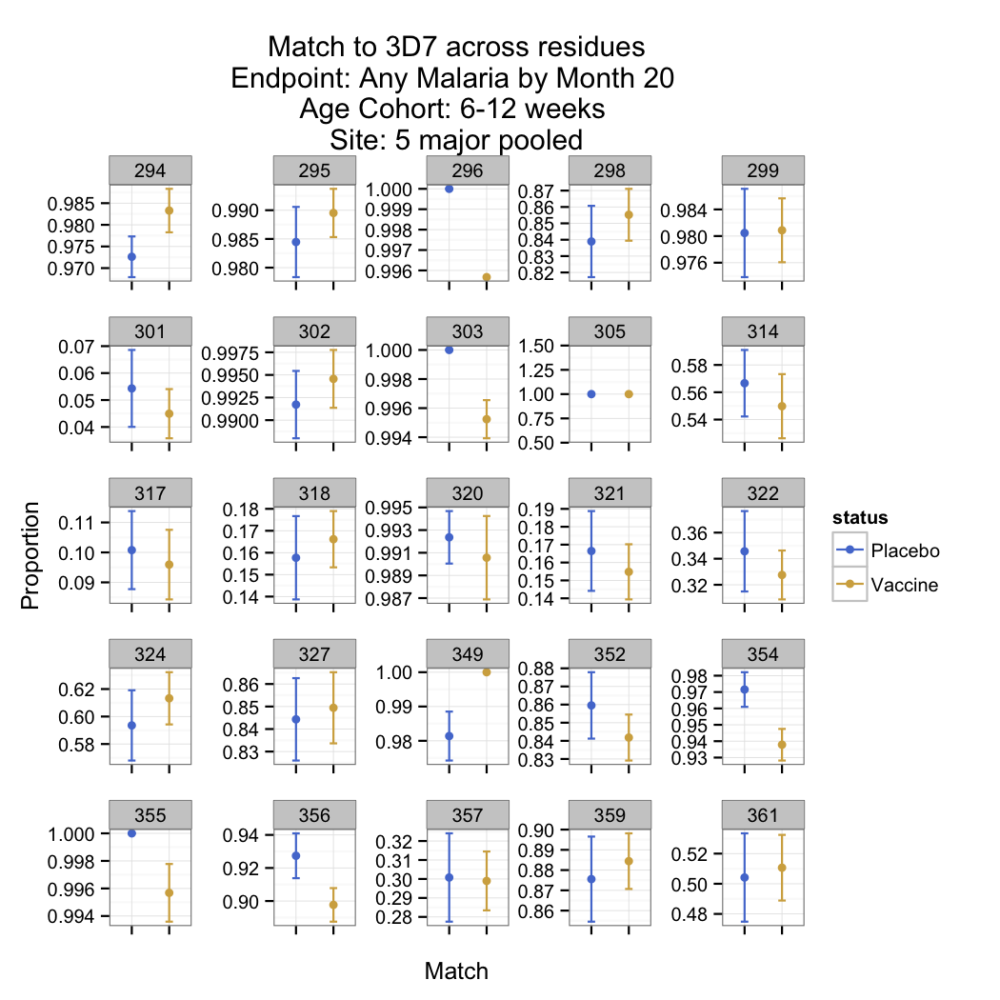
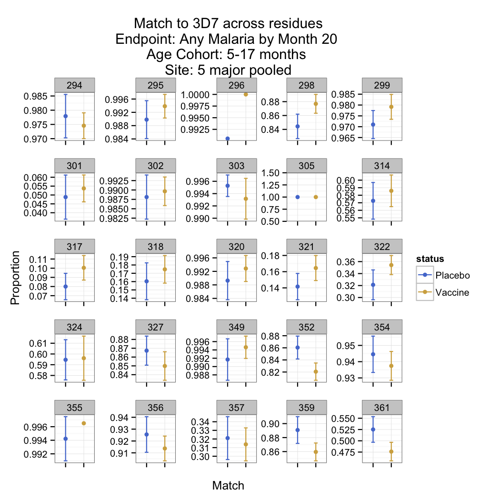

# Descriptive analysis of genotype data

## Setup

Set global variables and load packages and functions.

Load marks file.

Subset to just the 5 major sites.

Make function to randomly subsample to a single parasite per subject for a specific locus / mark / vaccine status combination.

Make function to summarize mean and standard deviation of histogram bins across subsamples.

Make plotting functions.

## Descriptive plots

 

 

 

 

 

 

 

 

 

 

 

 

 

 

 

 

 

 

 

 

 

 

 

 

 

 

 

 

## Residue-specific setup

Load marks file.

Subset to just the 5 major sites.

Collect summary across residues

Plot residue-specific match

## Residue-specific descriptive plots

 

 

 

 
